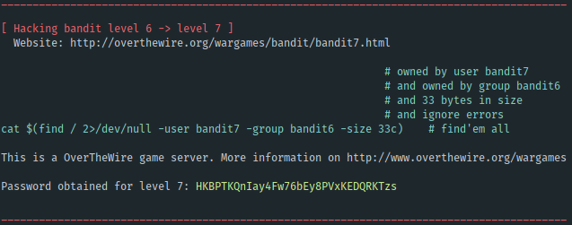

# :smirk_cat: Over the Wire
## Wargames
My scripts to solve [Wargames from Over the Wire](http://overthewire.org/wargames/)

### Sample
This is what output looks like


### Requirements
#### Flavor 1: Docker
- Docker
#### Flavor 2: Manually
- Bash
- Sshpass

### Usage
#### With Docker:
```bash
docker buid -t facevedom/overthewire .
docker run facevedom/overthewire
```

#### Manually
```
cd 1-Bandit
chmod +x *.sh
./hack_away.sh
```